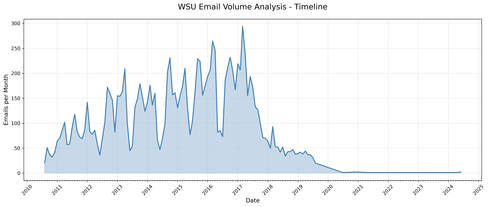
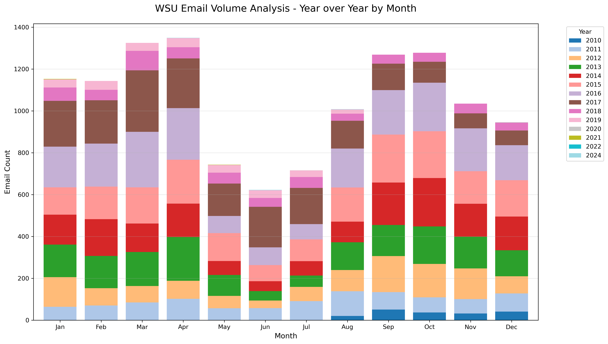
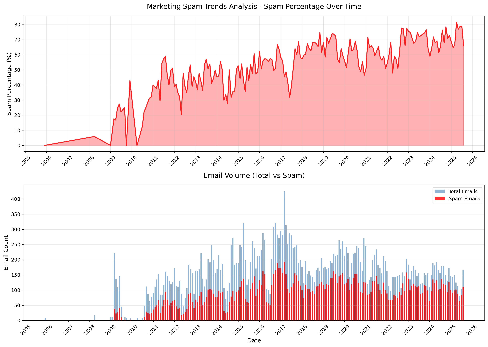
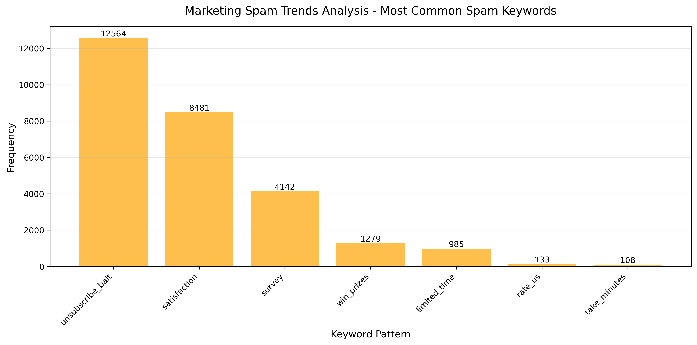
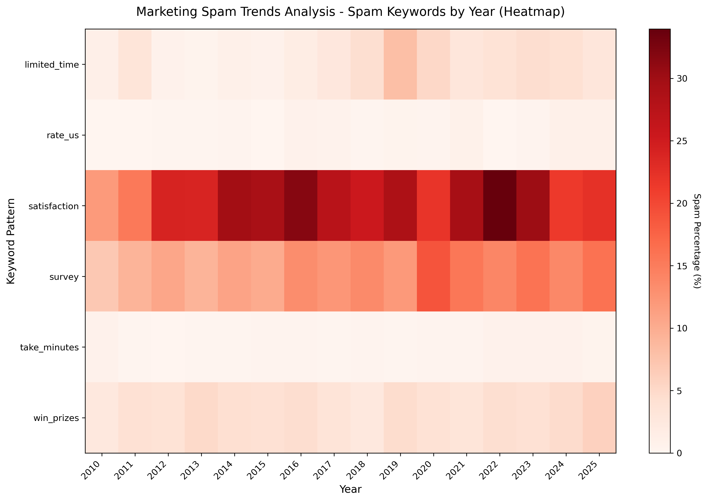

I'm not intentionally a data hoarder. I just haven't been an effective or aggressive email deleter or filter user. This has changed some in recent years, as the techniques for spam emails have evolved to covertly trojan "survey" subterfuge into my mailbox. 

## I have survey fatigue

Surveys are marketing emails. I can't believe I used to take the time to respond to some of them. An analysis on my email history has shown that my hunch on survey spam is correct. Around 2023, I began marking all surveys as spam, and I've got the data to prove just how rampant companies have used surveys to get their brand in your inbox.

## Emails that matter

My main goal in exploring my emails in-depth was to build a predictor of whether an email had any **future usefulness**. 

Mail from friends and family, correspondence with students, receipts and financial records, etc. fit the **binary of keep**. After I manually processed this massive backlog of email (with great help of Thunderbird's filters), what I found I discarded most, besides spam, were surveys, newsletters, and other mass mailers.

What I found, qualitatively, was:

- imperfect spelling, capitalization, and grammar
- little-to-no HTML markup
- all emails meant only for me sans phishing and spam

These traits defined true keepsakes.

## Introducing sanoma

[en.wiktionary.org/wiki/sanoma](https://en.wiktionary.org/wiki/sanoma)
    
    sanoma (noun) Finnish 
      message, communication (a communication or the content of a physical
      message; also the message contained in some act or expression such as a
      work of art)
    
**sanoma** ([github.com/brege/sanoma](https://github.com/brege/sanoma)) uses YAML workflows to define multi-step analysis pipelines. The workflow runner automatically discovers and executes tools from the `sanoma/analysis/` and `sanoma/plot/` directories, making it easy to chain data extraction, filtering, analysis, and visualization into reproducible pipelines.

I developed this YAML workflow method in my Markdown-to-PDF project--**[oshea](https://github.com/brege/oshea)**--where I realized comprehensive end-to-end tests were just manifest workflows. It's an intuitive way to string command line sequences together. The *pipeline* term in machine learning/data science is congruent to this system.

## Data Mining

While much of this can be done in a Jupyter notebook (far easier to refresh plots this way, although `:MarkdownPreview` in **Neovim** is sufficient), I built this project as a way to data-mine my own activity. I also want to create a visualization harness for many things on my computer:

- text message history
- email history
- screenshot frequency
- browser history and bookmarks

Because email is text-based, and because my first concept of "AI" was the need for combative spam filters that have been built over the last thirty years, email felt like a good starting point.

## Grad-school Emails

The monthly timeline reveals the academic year rhythm: high volume during active semesters with dramatic drops during summer breaks and winter holidays. The 2016-2017 dip corresponds to the dissertation defense period, where militant email sanitation was a reprieve from LaTeX and simulation monitoring--hence the dip.

My personal dataset has about 35K emails between my grad-school emails and [my current website's](https://brege.org) personal email. Not included are my Gmail and undergrad email(s). I plan on synchronizing those at a later date.

### Grad-school Timeline Seasonality

WSU's Okta system required changing passwords every 6 months, and some time after my defense my account died. I am thankful that I had a Thunderbird profile tucked away on a drive that allowed me to recover all of my university emails.

### Grad-school and onward Histogram

The year-over-year histogram demonstrates consistent academic seasonality, with September-April peaks and May -- mid-August valleys across all years of graduate study. Even with teaching summer labs, the bureaucratic pressure in the summertime dies. I loved teaching in the summer.

## Spam, Marketing, and Surveys

The spam timeline shows minimal marketing emails pre-2010, followed by a sharp increase around university enrollment. By 2015, spam reached 60-80% of all emails and has remained consistently high. The GDPR implementation around 2018 created a spike in `unsubscribe` language as companies scrambled to comply with new regulations.

### Marketing Spam Trends

The tail in the beginning of this timeline is presented for context.
It only includes a "purified" hotmail account mailbox from my teenage years that extended a bit into my undergrad years. Those years overlap with Gmail usage (not integrated into this data) and my GVSU university email.

### Keyword Buckets

Another useful filter for spam emails is checking for keywords like **`unsubscribe`** in the message body.

`unsubscribe_bait` dominates with over 12,500 matches, followed by `satisfaction` surveys (~8k) and direct "survey" requests (~4k). This reveals how modern marketing shifted from direct sales to engagement-focused tactics requesting feedback and reviews.

### Conclusion: Satisfaction Surveys are the new email cancer

The heatmap (filtered to post-2010) shows "satisfaction" spam as the most persistent threat, maintaining 20-25% frequency from 2012 onwards. Survey-based spam shows steady growth, intensifying after 2020, when both GDPR constraints pressured companies to invent new angles of attack, becoming increasingly desperate for customer "feedback" (attention) during the pandemic. **Satisfaction feedback surveys are advertisements.**
