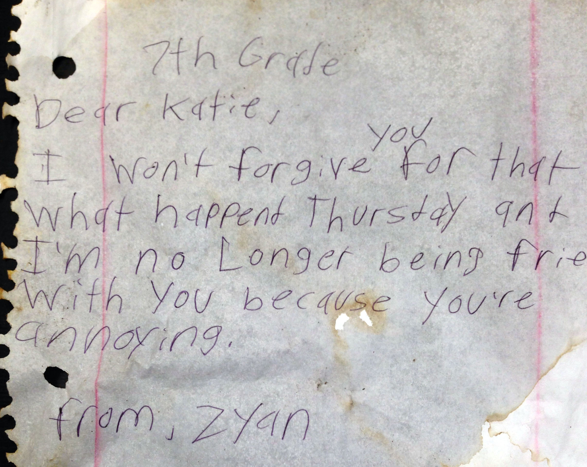

This is a small survey of a show, a magazine, and some music I like that each provide unique lenses into our world, which all involve foraging through humanities discards to help us find truer emotion and greater meaning. 

## The Books

[The Books](https://en.wikipedia.org/wiki/The_Books) were a musical duo that made music from found sound recordings.  Like a collage, bits of old personal casette tapes discovered at garage sales, thrift stores, and lost media found in old equipment and thrown out boxes were pieced together with minimal instrumention to create emotional, sonically beautiful tracks.

  
  
  

This mosaic of found sound and vocal samples in large part created a music genre in its own right.  Well, mostly.  I think most have heard songs that kickstart or bridge their songs with an audio clip taken from a nature doc, political speech, or other movie.  But The Books did this to the extreme.

 
[The Books - Smells Like Content (3:42)](https://www.youtube.com/watch?v=-lr9WshYouk)

In fact, each track is filled with an unimaginable number of recordings--sounds that bleed with every emotion of the original, forgotten storyteller within them.  There are also [aleatoric takes](https://en.wikipedia.org/wiki/Aleatoric_music) 

What compelled me most was that the recordings they used were largely unscripted, probably all of which I'd never heard before.  In fact, I doubt most people could recognize any, which only made it more intriguing.  I wondered about the people the may have listened to some of those source tapes on long road trips.  In their carpeted basements while tying flies.  Recording into a taperecorder a fried thought no one was around to hear.


[The Books - All Bad Ends All (2:42)](https://www.youtube.com/watch?v=oD4anv60ow8)

## Found Magazine

[Found Magazine](https://en.wikipedia.org/wiki/Found_Magazine) was created by another duo in Ann Arbor, Michigan whose pages were a collage of scrap notes and photos sent in to the editors.  In it, these glimpses of everyday minutia are scanned into its pages, usually without any continuity, often bearing some of the weather and stains obtained on its way in and out of the trash.

[Source](https://images.squarespace-cdn.com/content/507dba43c4aabcfd2216a447/1377200982709-D8CFHDZBV9GAUZ38NUC9/FOUND+Magazine+Covers.jpg?format=1000w&content-type=image%2Fjpeg)

Amid a probable banality, the subjects of some of these clippings range anywhere from odd grocery store requests to people dealing with heavy topics like abortion, divorce, and suicidal thoughts.  I was in my very early twenties when my college friends introduced me to it, and while I had every opinion imaginable about the world, I certainly didn't have the experience and plight some of these notes conveyed. 

There was sheer earnesty to them.  A glimpse into worlds you couldn't ever possibly live.
People's experiences simultaneously made relatable yet unlivable.

[Source](http://foundmagazine.com/find/annoying/)

It is no wonder why this magazine was so popular in the US penal system.  Reality TV is contrived and dramatized.  And documentaries are often overly prompted.  But the stories in *Found* were of a different species, one that was free of slant, rich in humor, emotion, and imperfection.

## How To with John Wilson

[Source](https://static1.colliderimages.com/wordpress/wp-content/uploads/2022/01/How-To-With-John-Wilson.jpg)

Arguably the most inaccurately titled show ever, John Wilson sets out in New York City with nothing but his video camera recording, as he has done since he was a child, literally everything. In his docuseries [How To with John Wilson](https://en.wikipedia.org/wiki/How_To_with_John_Wilson), there are shots of spills and overflowing trash, candid public moments and private invitations, people spontaneously napping or ritualistic maneuvers that all walks of city life take.  But moreso, it's the profoundly deep cuts into the human experience accompanying the imagery that make it so special.


YouTube: [How To with John Wilson - Touch and Go](https://www.youtube.com/watch?v=UUiRM7NOOow)

What I loved about this show, which thankfully made it to (but sadly ended in) three seasons, was the juxtaposition of Wilson's unpolished interview/questioning skills with a carefully well thought-out narrative.  There is an incredible mastery of using random, second-long bits to string together larger, much broader points about our experiences in the world.  

The travelogues benefit from people living in tight proximity among almost entirely manmade things.  Even when journeying, in promptu, out West to fail in filming **Burning Man**, Wilson somehow winds up inside an underground, former nuclear launch bunker that feels just as claustrophobic and unnatural as the city he's escaped.

## Conclusions

While unfortunately these mediums aren't widely known nor around anymore, I think about them often when I forage for different things on my hikes. 
I mean, in that practice, you are doing something of a natural evolutionary value.
So maybe I'm intrigued by *The Books*, *Found*, and *John Wilson* for a similar lust, that it hits such a similar psycological mechanism is probably no accident.

In restaurants or classroom settings, I often found notes or items left behind, and in an effort to determine their owner, the content sometimes surprised.  We don't always know who our audience is.  And I think that's actually quiet wonderful.

