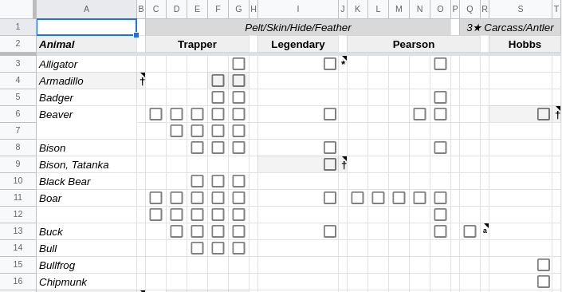
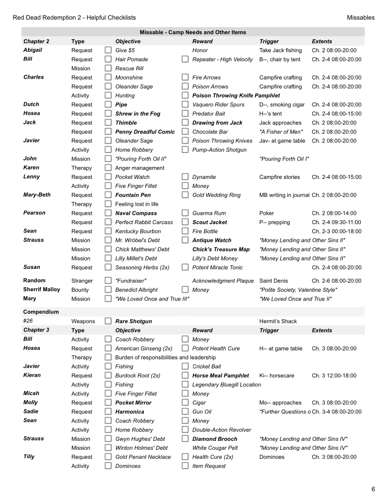

I've put together a Google Drive spreadsheet for the avid Red Dead Redemption 2 completionist.  It's almost a 100% checklist, but mostly useful as a way to keep track of progress that plays nice in both print and mobile form.

[:link: RDR2 Completionist Checklist (Google Sheets)](https://docs.google.com/spreadsheets/d/1wBuPPvN-Y4K115rBQrOP559tG2oCTfUjTCTBgZSJwRA/edit?usp=sharing)

> ### 2025 Note on Google Drive/Sheets
>
> **In order for you to edit this, you need to:**
> 
> 1. Open the spreadsheet in [:link: **Google Sheets**](https://docs.google.com/spreadsheets/d/1wBuPPvN-Y4K115rBQrOP559tG2oCTfUjTCTBgZSJwRA/edit?usp=sharing) while **signed in** with your account
> 2. **File > Make a copy**
>
> This will add a completely editable copy in your Google Drive. I've gotten a lot of requests to edit this spreadsheet!
>
> *If you do not have a Google account*: you can use this [**PDF version**](./rdr2-checklist.pdf) instead. On my last playthrough, I made sure the page breaks were well placed so I could print them out and mark them off as I played. 

While not a replacement by any means for the various user made maps and guides out there, I wanted everything consolodated in a form similar to what I had already been doing with a little notebook while I played.

  - **Hunting**: these are animals that you need for the Trapper, Mr. Pearson, Ms. Hobbs, and the legendaries.  Daggers † are reserved for the epilogue, officially, and have a grey background.
  - **Plants + Fish**: combined on the same sheet so they can be printed together.  Also, there's some markers in there that indicate challenges, recipe usage/bait types, and some other information available :on hover:
  - **Horses**: this was actually a major pain to put together! With Rockstar updates and online content being incosistent, there is a definite need out there for these to be consolodated and made tidy.
  - **Missables**: sorted first by character; this includes:
    - camp requests
    - companion activities
    - missable compendium weapons and "unique item" satchel contents
  - **Collectables**: a grid to help demarcate collectable discovery (again, some have grey backgrounds if inaccesible for much of the story)
  - **Weapons**: see key for more details

This guide can be used to checkoff *discovered* recipes and items, avoiding purchase from the fence, but mostly to fully complete the compendium (and sometimes it takes too many clicks and scrolls in the pause menu).  Items that are **bolded** are uniquely obtained, some of which are missable, or can be sold and never obtained again.

There are page breaks to make printing easier.  Saving a copy of the Google Sheet will also allow you to use it on your phone quite well.  Or, here's the full
[ PDF Checklist :arrow_down: ](./rdr2-checklist.pdf)

