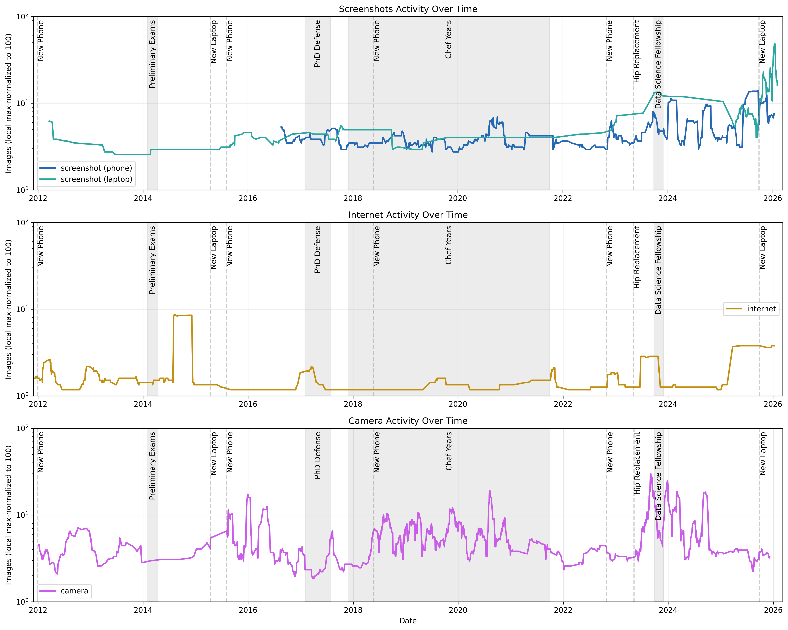
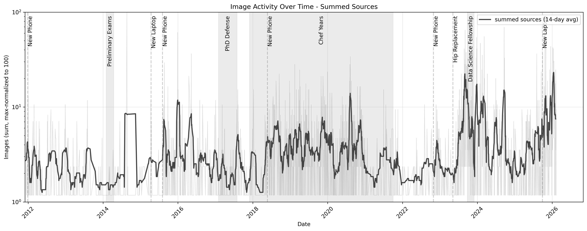
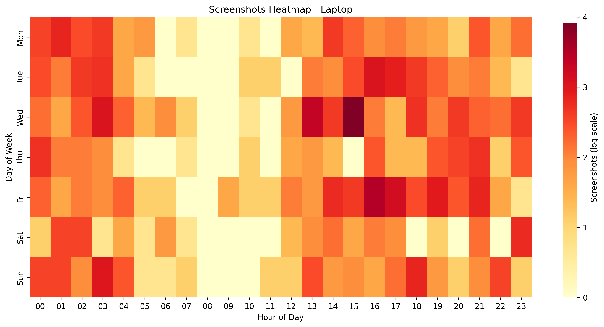
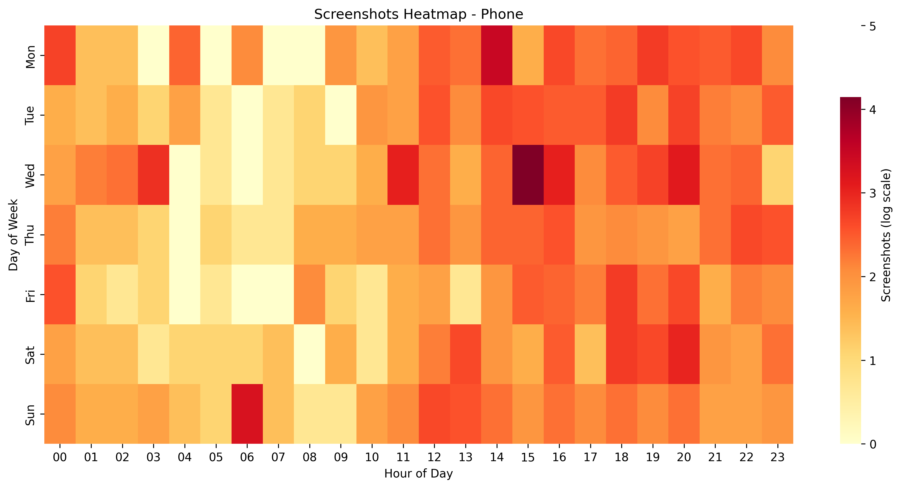
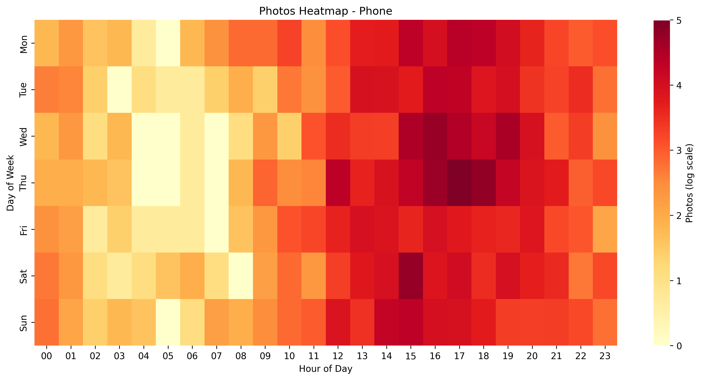
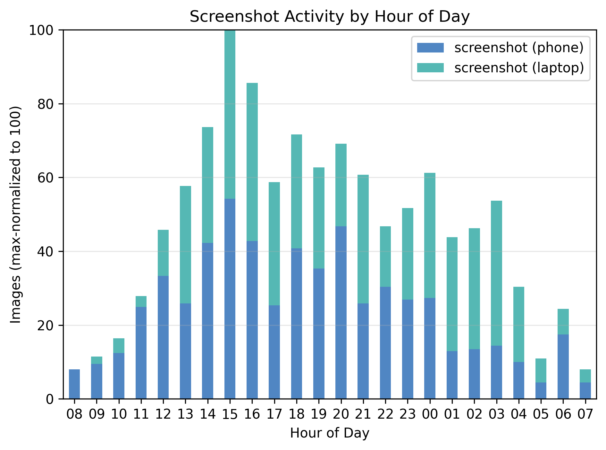
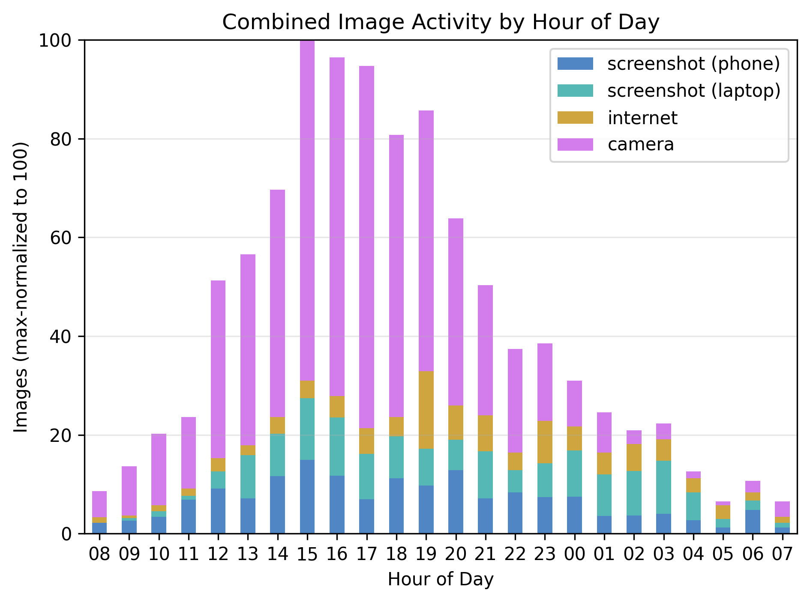
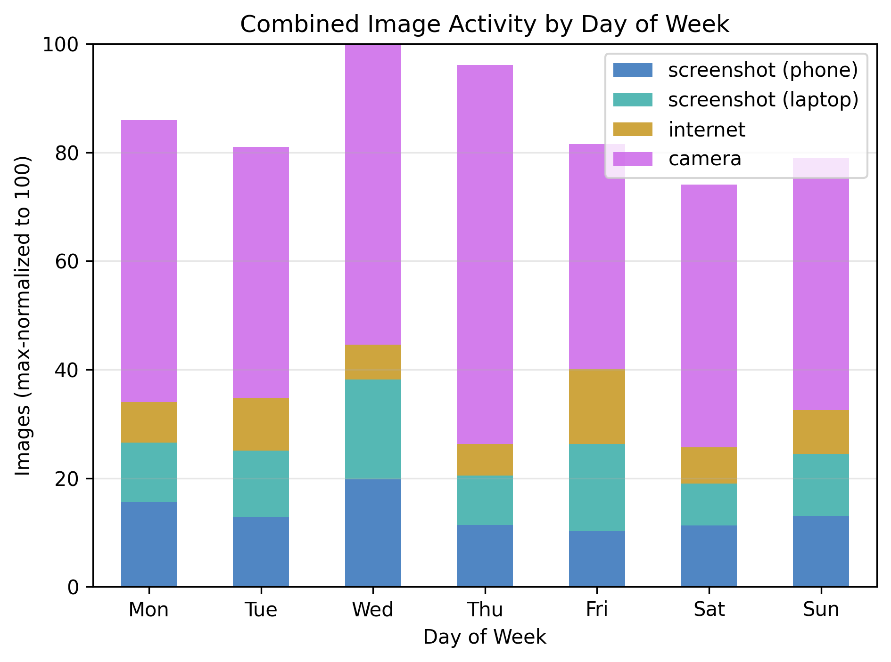
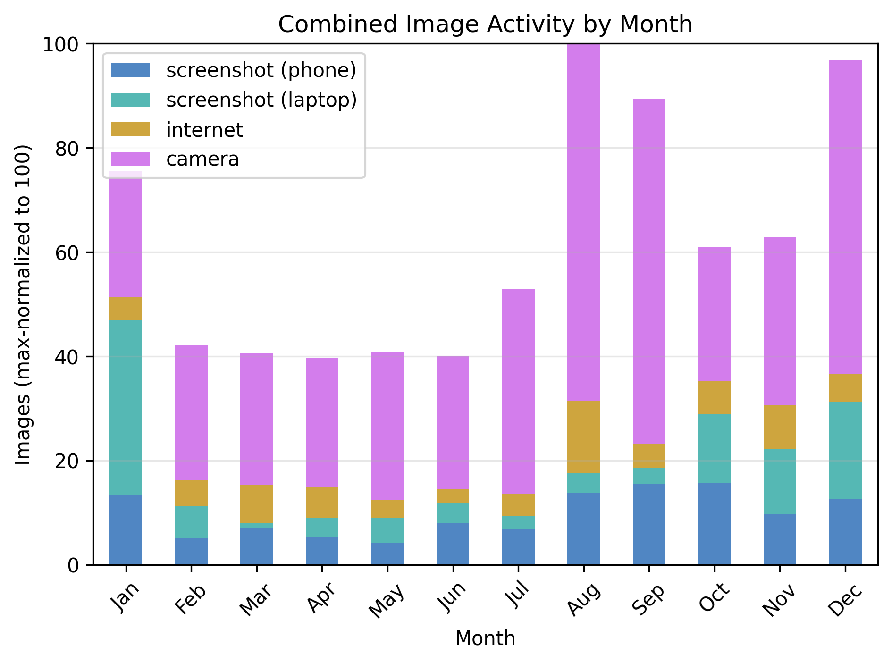

This project part of a series of data exploration projects around my personal computer usage.

GitHub link: [github.com/brege/image-activity](https://github.com/brege/image-activity)

This is related to my email classification project: [github.com/brege/sanoma](https://github.com/brege/sanoma) (work in progress).

## Overview

- Generate heatmaps and histograms of image saving activity over hours, days, and months
- Use file timestamps, modified-times, EXIF, and regex parsing for refined image discovery
- Add bands and markers for major life events

## Background

I wanted to determine if my image activity is dependent on major events and device purchases in my life.

- do I tend to take more pictures during certain times of year?
- how has my screenshot usage evolved over the last 15 years?
- do I have "honeymoon" periods after a device purchase?
- in what ways has my camera and screenshot usage changed between being an academic, chef, and developer?

I'm not a social media person, although my [mastodon](https://mastodon.social/@brege) did see an uptick of usage following my hip surgery, where I began hiking and foraging a lot.

My image activity fits in three main categories:

1. **camera**: storage of camera photos from my phone
2. **screenshots**: screenshots on both my laptop and phone
3. **internet**: pictures downloaded from the internet

## Gallery

I've marked in these first line charts, [Camera Usage](#camera-usage) and [Image Capture Concurrency](#image-capture-concurrency), times when I've purchased a major device (a new phone or laptop) and a couple key periods of my life. These plots have all been normalized to a 0-100 photo count scale.

### Camera Usage

From 2010 to 2017 I was a Physics TA and, following my 2014 physics prelims, a computational astrophysics doctoral researcher. I began attending conferences in 2015, exploring places around Pullman, WA during these researcher years there.

At the end of 2017, I left that life. I embraced my love of food and cooking and became a professional chef for a number of years thereafter, including the Covid-19 pandemic. This period of my life saw a greater number of photos taken: pictures of plates, menus, schedules, etc. My camera photos before this time were mostly non-work-related: travel, events, and pets drove image origination.

### Image Capture Concurrency

### Heatmaps

I only have one experience with online coursework: the data science bootcamp I attended in the fall of 2023. This period did not have a major impact on my screenshotting habits. There are three principal areas in which screenshot usage was more frequent:

1. The creation of my website [brege.org](https://brege.org) around August 2016. 
2. As an executive chef, screenshotting is recurrent for scheduling, text message records, receipts/purchase dates, etc. 
3. Agentic-driven coding workflows, beginning midway through 2025, saw a surge in screenshot usage. Screenshots have become a large part of my front-end debugging workflow for web app development--extending well beyond data-structured [Cypress](https://www.cypress.io) end-to-end tests.

I did not find my screenshot usage noticeably change during my brief stint with online coursework.

<table>
  <tr>
    <td></td>
    <td></td>
    <td></td>
  </tr>
</table>

In general, it appears that I take more screenshots on desktop earlier in the week and in the afternoon (averaged over the last ~15 years). To my surprise, the heatmap for screenshots on my phone have nearly identical densities. I assumed this would be biased toward the weekend and closer to 17:00 because of sports and restaurant dinner service.

Camera usage frequency, on the other hand, is made distinct by day of week only on density during Thursday evening and Saturday afternoon.  It's especially featured in both my Chef days and post-op mobility.

### Histograms

By device and source, then binned on hours of the day, day of the week, and month of the year, histograms provide a finer distribution in one dimension.

<table>
  <tr>
    <td></td>
    <td></td>
  </tr>
</table>

For the hourly concentration of all three photo habits, my activity roughly follows a Boltzmann distribution.

These distributions generally peak at two distinct hours:
- camera photos and screenshots center around 15:00
- internet photos are generally concentrated around 20:00

Each bin is averaged for each picture type over the last 15 years, regardless of timezone.

<table>
  <tr>
    <td></td>
    <td></td>
  </tr>
</table>

Image activity generally increases at the beginning and end of standard university semesters, which also include the height of summer and the holiday period when I am always always travelling. Screenshotting is highest in the fall to mid-winter. 

In my experience, restaurants are historically busier between, roughly, Friendsgiving and Father's Day. Camera usage also largest during high summer. Beach. Hiking. Produce selection during chef years. 

